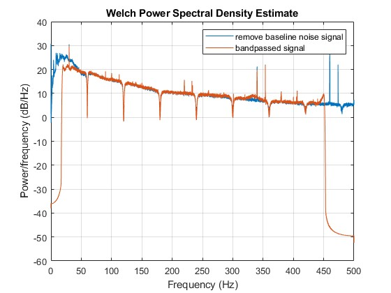
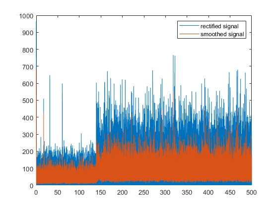

# Develop Preprocessing Method for EMG data

**processing flow**
- Step 1 notchfilter: remove baseline noise
- Step 2 bandpass filter: remove unrelated signal
- Step 3 Remove ECG from EMG ...?
- Step 4 Rectifying and smoothing by RMS (time window 10 ms)
- Step 6 Downsampling
- Step 7 separate data to each trail (3d double array)

## Step 1 notchfilter: remove baseline noise

Notchfilter information:
'''
type: butterworth
order: 2 
cutoff frequency: 59 ~ 61 Hz, 119 ~ 121 Hz, ... , 479 ~ 481 Hz
'''

How signal changed time and frequency spectrum

Solarized dark             |  Solarized Ocean
:-------------------------:|:-------------------------:
  |  

## Step 2 bandpass filter: remove unrelated signal

Bandpass filter information:
'''
type: butter worth
order: 2
cutoff frequency: ~ 40 Hz and 450 Hz ~
'''

How signal changed time and frequency spectrum

 

## Step 3 Remove ECG from EMG ...?

I couldn't detect ECG signal from EMG

 
 
 

## Step 4 Rectifying and smoothing by RMS (time window 10 ms)

Rectify: making all negative value positive
Smoothing: Choose RMS-EMG (we may change later)

How signal changed time time window 10m, 50m, and 200m sec

  

## Step 5 Down sampling

Downsampled from 10 KHz to 1 KHz

## Step 6 separate data to each trail (3d double array)

get mean trajectory of EMG data

figure 
figure 