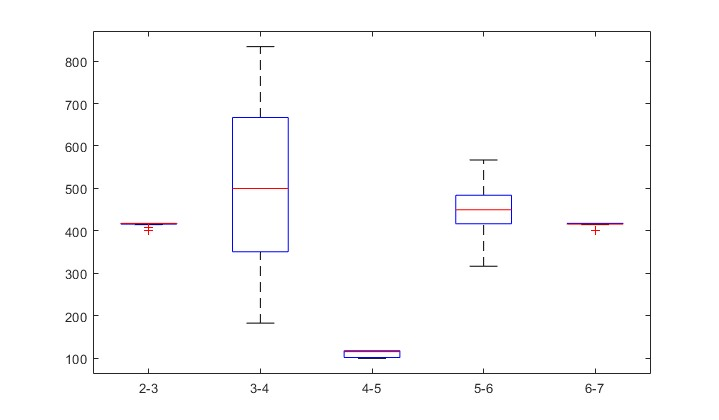

# Goal: get clear relationship between EMG and reward experiment

## Today's Goal: check the relationship between EMG and Reward

How to measure it?
- different condition
    - EMG change at different reward
    - EMG change at different direction
    - EMG change at different reward and direction

what data I use?
- mean RMS-EMG of each trail at different reward and direction

## Report

### 0. modify preprocessing

- apply welth's method for visualizing PSD
- change cutoff frequency of bandpass filter lower
- Check ECG signal was contaminated at rest(~120s)

#### apply welth's method for visualizing PSD

#### change cutoff frequency of bandpass filter lower

#### Check ECG signal was contaminated at rest(~120s)

### 0. check the data structure

before determine how to analyze, find the fact that each trial has a different time scale.
It's difficult to make figure.
I have to understand state-transition and think again what EMG signal I use for analysis.

there are 6 type of state transition( the number in the parentheses is the amount of the trial of the state transition)
- 1,2,3,7 (40)
- 1,2,3,11,21 (71)
- 1,2,3,4,5,6,7 (772) 
- 1,2,3,4,11,21 (21)
- 1,2,3,4,5,12,21 (121)
- 1,2,3,4,5,6,13,21 (119)

This result suggests me that I should separate data by the state-transitions

And also, it is a bigger problem, but the transition time between the state is different in single trial. here is the histograms of each transition time

# PS - after meeting with Adam 8/9

Adam answered these questions
- how to use EMG data at different time length
- how to use EMG data at different state transition

that **We pick up data based on the analysis we want**. And as a first step of the analysis, We determined to use data around Go Cue(-200ms to +600ms)

Also, he explained why there are variations in the same state transition

2-3; 4-5, 6-7: there were +- 16,17 ms results => sampling rate of movement is 60Hz so that 1 frame error made this strange phenomenon.
4-5; this is for detecting cheating, monkey can't move within 100ms after Go Cue
4-6; if a monkey spend time more than 666ms, the trial become failure
