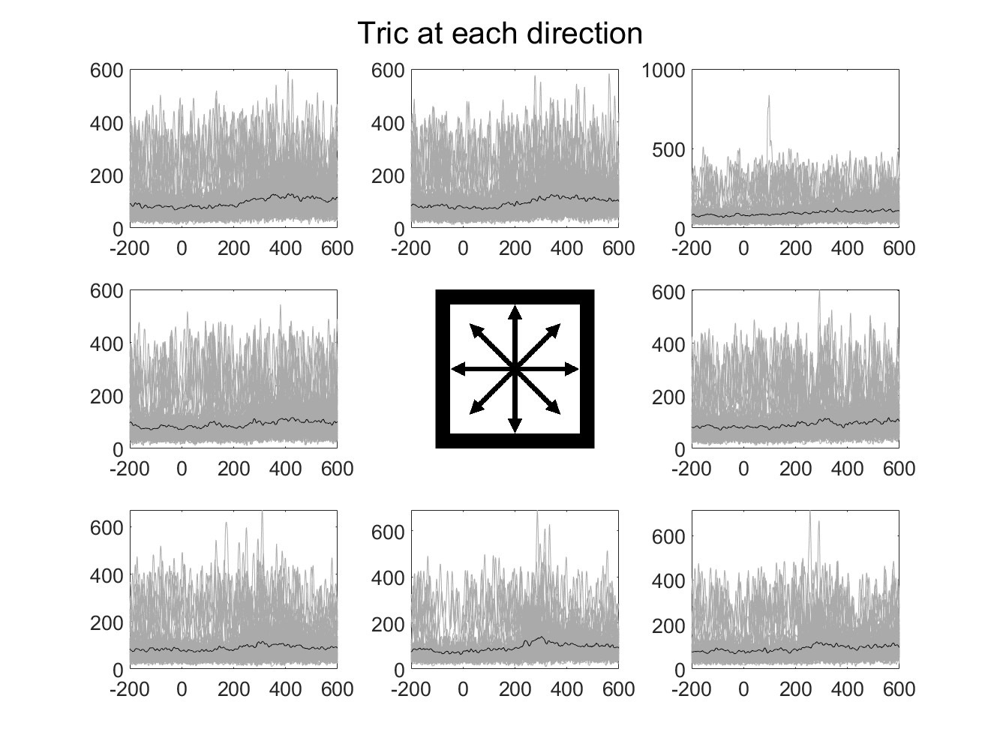
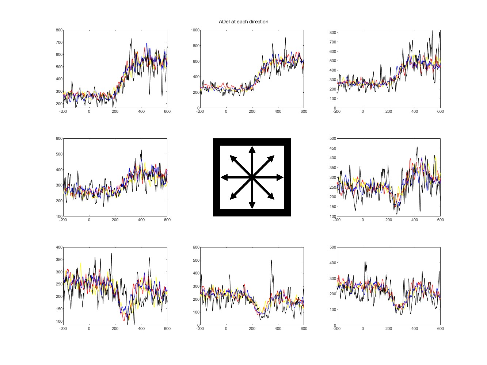

# visualize EMG signal around Go Cue

## mean trajectory at each direction and reward

Information:
- use only successed data
- MEG signal around Go Cue (-200 ms ~ +800 ms)
- gray lines are each trials and brack line is a mean trajectory
- position of figure means direction

