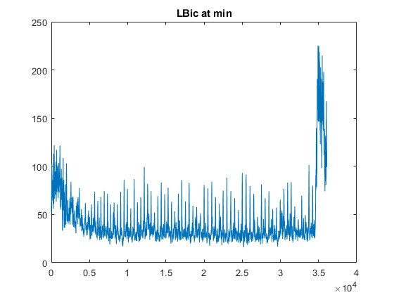

# Normalizing EMG data across days

## Step0: become familiar with the new data

**why synchInfo.taskSynchTrialTimes and trial data is different length???**

Get the index of data in taskSynchTrialTimes which is excluded from trial data
1 2 3 4 5 6 7 8 27 28 37 43 46 80 123 196 200 228 234 260 274 335 342 387 410 413 424 428 447 458 511 534 579 599 610 623 627 675 695 702 717 719 725 736 744 756 774 775 791 874 878 897 903 913 915 963 969 970 980 987 1006 1017 1036 1053 1086 1092 1195 1206 1208 1209 1210 1217 1229 1234 1260 1270 1271 1317 1328 1339 1351 1360 1367 1380 1434 1438 1444 1450

huge variance

## Step1: remove data when the EMG sensors are disconnected

Methods
- get mean EMG voltage in each trial, then visualize it
- find the abnormal point, check if it is artifact

get max and min index at each muscle
Channel: Trap, max: 976, min: 1094 
Channel: PDel, max: 830, min: 1094 
Channel: Tric, max: 975, min: 1094 
Channel: LBic, max: 969, min: 1094 
Channel: ADel, max: 1223, min: 1094 

Max EMG             |  Min EMG
:-------------------------:|:-------------------------:
  |  
  |  
  |  
  |  
  |  

